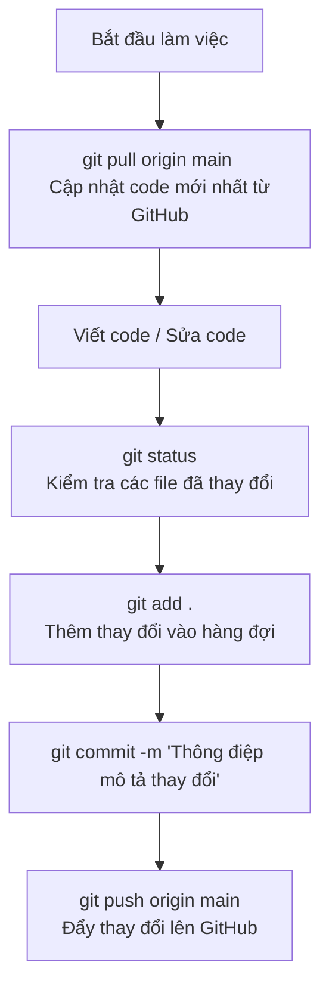

# Hướng Dẫn Sử Dụng Git & Đẩy Code Lên GitHub

Tài liệu này hướng dẫn chi tiết các bước để khởi tạo Git, đẩy code lên GitHub và xử lý các lỗi thường gặp trong quá trình làm việc.

---

## 1. Các bước đẩy code lên GitHub lần đầu (Dự án mới)

Khi bạn có một thư mục code trên máy tính và muốn đưa nó lên một kho chứa (repository) mới trên GitHub:

### Bước 1: Khởi tạo Git cục bộ
Mở terminal tại thư mục dự án và chạy lệnh:
```bash
git init
```

### Bước 2: Tạo file `.gitignore`
Tạo một file tên là `.gitignore` ở thư mục gốc để bỏ qua các file không cần thiết (như các thư mục ảo `.venv`, cache `__pycache__`, file log, các file dữ liệu nặng...).
> **Mẹo:** Bạn có thể sao chép nội dung `.gitignore` chuẩn cho Python từ kho chứa mẫu.

### Bước 3: Thêm các file vào hàng đợi và commit
Thêm tất cả các file trong thư mục vào Git:
```bash
git add .
```
Tạo commit đầu tiên ghi nhận trạng thái code:
```bash
git commit -m "Initial commit - Thêm mã nguồn dự án"
```

### Bước 4: Đổi tên nhánh mặc định thành `main`
```bash
git branch -M main
```

### Bước 5: Liên kết với Repository trên GitHub
Lấy URL của repository trên GitHub (ví dụ: `https://github.com/username/repository-name.git`) và chạy:
```bash
git remote add origin <URL_REPOSITORY_CỦA_BẠN>
```

### Bước 6: Đẩy code lên GitHub
Sử dụng tham số `-u` để thiết lập nhánh theo dõi mặc định cho các lần sau:
```bash
git push -u origin main
```

---

## 2. Quy trình cập nhật code hàng ngày (Khi đã cấu hình xong)

Mỗi khi bạn sửa đổi hoặc thêm code mới, hãy thực hiện các bước sau:



### Chi tiết các lệnh:
1. **Kiểm tra trạng thái thay đổi:**
   ```bash
   git status
   ```
2. **Thêm các file thay đổi vào Git:**
   ```bash
   git add .
   ```
3. **Commit kèm mô tả ngắn gọn về những gì đã thay đổi:**
   ```bash
   git commit -m "Mô tả thay đổi (ví dụ: cập nhật giao diện, sửa lỗi train)"
   ```
4. **Đẩy code lên GitHub:**
   ```bash
   git push origin main
   ```

---

## 3. Các lỗi thường gặp và cách xử lý

### Lỗi 1: `fatal: 'origin' does not appear to be a git repository`
* **Nguyên nhân:** Bạn chưa liên kết repository cục bộ với GitHub bằng lệnh `git remote add origin`.
* **Cách khắc phục:** 
  Chạy lệnh để thêm remote:
  ```bash
  git remote add origin <URL_CỦA_BẠN>
  ```
  Để kiểm tra xem đã cấu hình remote thành công chưa, chạy:
  ```bash
  git remote -v
  ```

---

### Lỗi 2: `fatal: refusing to merge unrelated histories`
* **Nguyên nhân:** Xảy ra khi bạn cố tình gộp/kéo code (`git pull` hoặc `git merge`) từ một repository GitHub đã có sẵn file (như README, LICENSE) về một thư mục cục bộ được khởi tạo độc lập (hai nguồn này không chung lịch sử commit ban đầu).
* **Cách khắc phục:**
  Cho phép Git gộp hai lịch sử không liên quan bằng cờ `--allow-unrelated-histories`:
  ```bash
  git fetch origin
  git merge origin/main --allow-unrelated-histories -s ours -m "Gộp lịch sử từ GitHub"
  ```
  *(Sử dụng `-s ours` nếu bạn muốn giữ nguyên hoàn toàn code ở máy cục bộ và chỉ gộp lịch sử để đẩy lên)*

---

### Lỗi 3: Thư mục con bị biến thành Submodule (màu xám trên GitHub, không click vào được)
* **Nguyên nhân:** Bạn thực hiện clone một repository khác vào bên trong thư mục dự án của mình, khiến thư mục con đó chứa một file ẩn `.git`. Khi bạn chạy `git add .` ở thư mục cha, Git sẽ nhận diện thư mục con này là một repository con (submodule) chứ không phải là các file thông thường.
* **Cách khắc phục:**
  1. Xóa thư mục con khỏi bộ nhớ đệm (index) của Git (không xóa file thật):
     ```bash
     git rm --cached <tên_thư_mục_con>
     ```
  2. Xóa thư mục ẩn `.git` bên trong thư mục con đó để biến nó thành thư mục bình thường:
     * Trên Windows (PowerShell):
       ```powershell
       Remove-Item -Recurse -Force <tên_thư_mục_con>\.git
       ```
     * Trên Linux/macOS hoặc Git Bash:
       ```bash
       rm -rf <tên_thư_mục_con>/.git
       ```
  3. Thêm lại và commit:
     ```bash
     git add .
     git commit -m "Fix submodule issue"
     git push origin main
     ```
